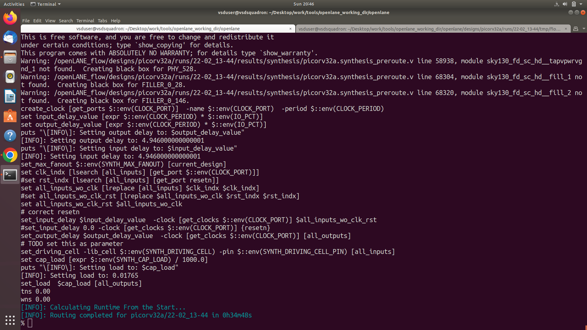

# Day 5 — Routing, Sign-Off Checks and Final Layout Generation

---

## PART 1 — THEORY

### Signal Routing and Physical Connectivity

Day-5 concentrates on completing the physical connections between all standard cells and preparing the design for final verification. After Clock Tree Synthesis, cells and clock buffers are already positioned, but electrical connections still need to be established. Routing is the stage where metal layers are used to create wires that connect pins according to the gate-level netlist.

Routing occurs in two main phases:

- Global Routing
- Detailed Routing

Global routing estimates paths for interconnections by dividing the layout into routing regions and calculating congestion. Detailed routing assigns exact tracks while respecting design rules such as spacing, metal width, and via placement.

Signal integrity becomes important at this stage. Long wires introduce resistance and capacitance, increasing delay. The routing tool balances path length with congestion avoidance to maintain timing performance.

---

### Design Rule Checking and Layout Verification

Once routing is completed, the design must undergo verification to confirm that it meets fabrication constraints.

- Design Rule Checking (DRC) validates spacing, width, and alignment requirements.
- Layout Versus Schematic (LVS) confirms that the routed layout matches the original logical netlist.

These checks ensure that the design can be manufactured without errors.

---

### Generation of Final Layout Data

After routing and verification, the design is exported into a GDS-II file. This file contains all geometric information required by the foundry, including:

- Cell placements
- Routing layers
- Power structures

The GDS-II file represents the physical outcome of the entire RTL-to-GDS process.

---

## PART 2 — IMPLEMENTATION

### Section 1 — Initiating Routing Stage

The routing stage begins using the DEF produced after Clock Tree Synthesis. The routing engine reads connectivity and placement coordinates to determine optimal signal paths.

Both global routing estimation and detailed routing execution are performed automatically.

---

### Section 2 — Metal Layer Utilization and Wire Optimization

Different metal layers are used for horizontal and vertical routing directions. The tool minimizes wirelength while maintaining spacing rules and inserting vias between layers for connectivity.

The routing structure becomes visible in layout visualization tools.

---

### Section 3 — Design Rule Checking and Verification Preparation

After routing completes, verification tasks confirm adherence to fabrication rules. Designers review DRC and LVS reports to ensure there are no violations.

---

### Section 4 — Final Layout Preparation

The final step prepares the design for export into the GDS-II format. The layout now contains:

- Placed cells
- Clock buffers
- Routed metal layers

Successful reports indicate readiness for final layout generation.

---

## PART 3 — DAY-5 COMMAND TIMELINE + OUTPUT RESULTS

### 1. Entering the OpenLANE Interactive Environment

```bash
cd OpenLane
./flow.tcl -interactive
```

Purpose:

- Launch OpenLANE and load technology configuration.

---

### 2. Preparing the Design

```bash
prep -design picorv32a
```

Purpose:

- Load previous stages including placement and CTS results.

---

### 3. Running Routing

```bash
run_routing
```

Purpose:

- Perform global routing estimation
- Execute detailed routing

Outputs Generated:

- Routed DEF file with metal connections
- Routing reports
- Routing logs


---

### 4. Viewing placement Reports

         
---
### 4. Viewing Routing Reports

```bash
less runs/picorv32a/reports/routing/*.rpt
```

Observed:

- Routing completion status
- Metal layer usage
- Congestion information


---

### 5. Inspecting Routing Logs

```bash
less runs/picorv32a/logs/routing/*.log
```
  
---

### 6. Opening Routed Layout in Magic

```bash
magic -T sky130A.tech lef read merged.lef def read <routed.def> &
```

Result:

- Layout shows metal wires connecting placed cells.

   
---

### 7. Checking Design Rule Violations

```bash
less runs/picorv32a/reports/signoff/*.rpt
```

Purpose:

- Review DRC or verification results before final export.

      
---

### 8. Generating Final GDS Layout

```bash
run_magic
```

Purpose:

- Export the final physical layout.

Output:

- `.gds` file representing the complete chip layout.

---

## Day-5 Outputs Generated

- Routed DEF file containing final metal interconnections
- Routing reports describing congestion and layer usage
- Sign-off verification reports
- Final GDS-II layout file
- Layout visualization showing full chip structure

---

## Day-5 Flowchart — CTS to Final Layout

```
CTS DEF + Netlist
        |
[Global Routing]
        |
Detailed Routing
        |
Design Rule Checking
        |
Final Layout Generation (GDS)
```

The routing stage converts placement and clock distribution into a fully connected physical design by creating metal interconnections that satisfy technology rules and timing constraints.