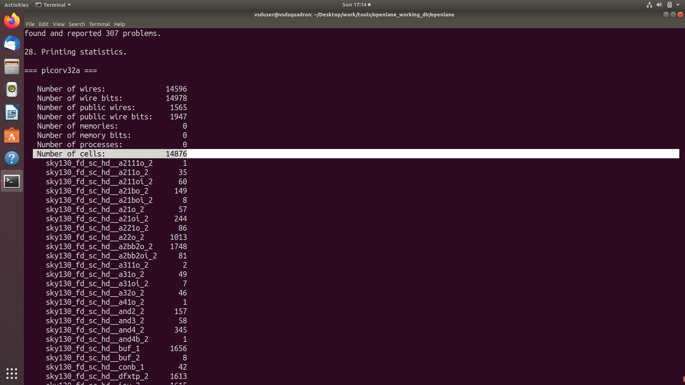
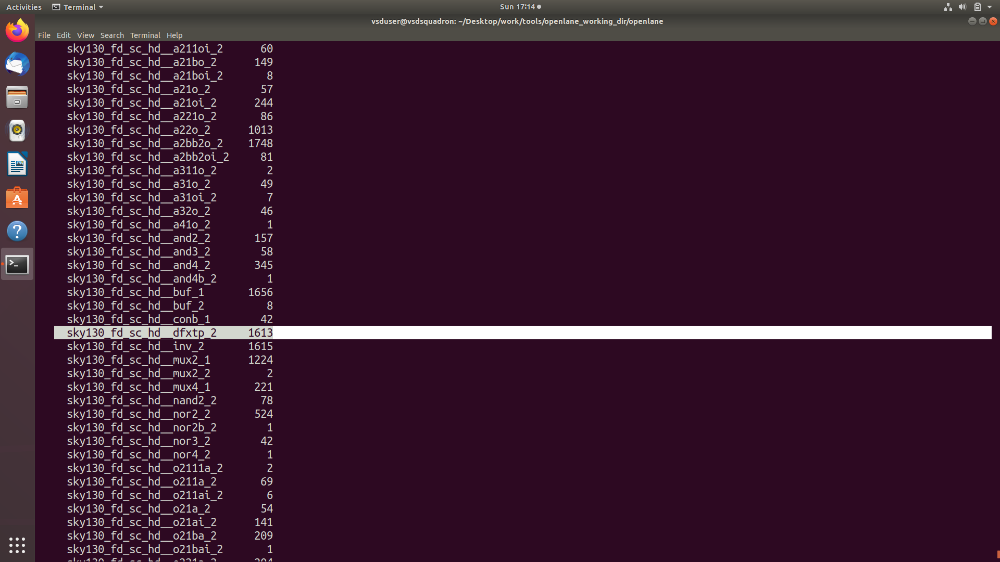
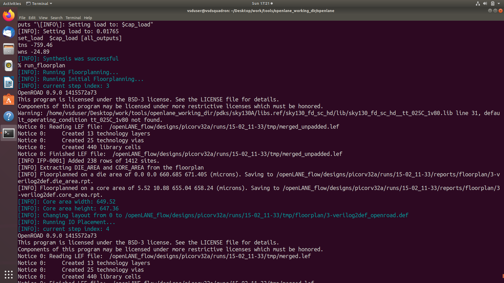
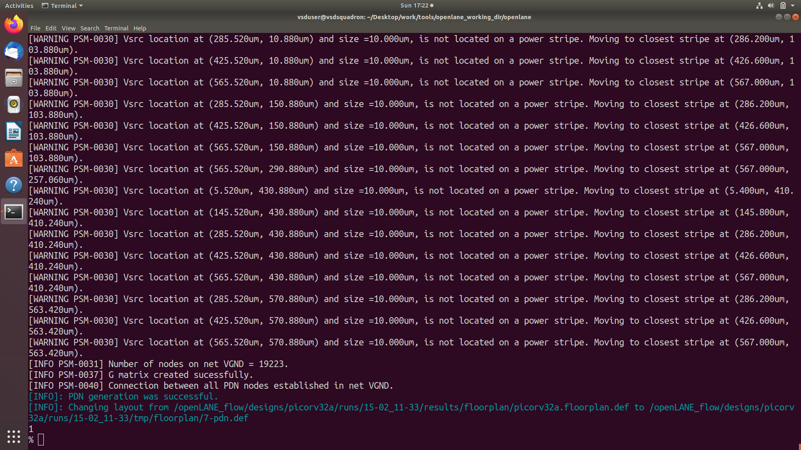
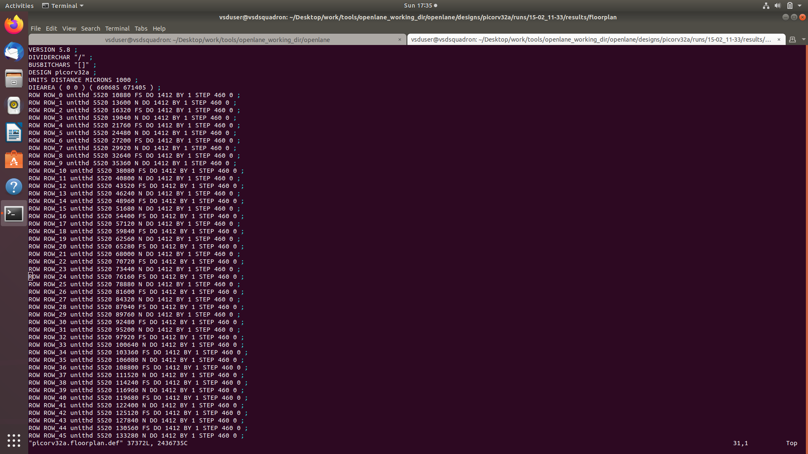
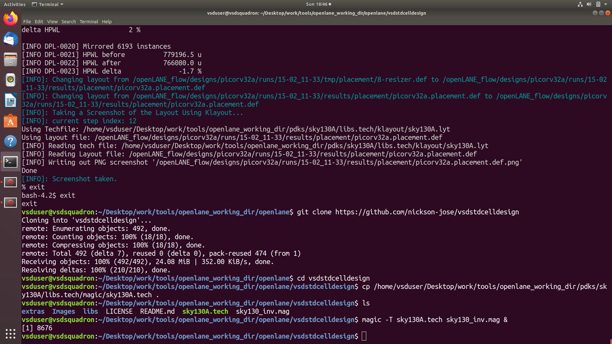
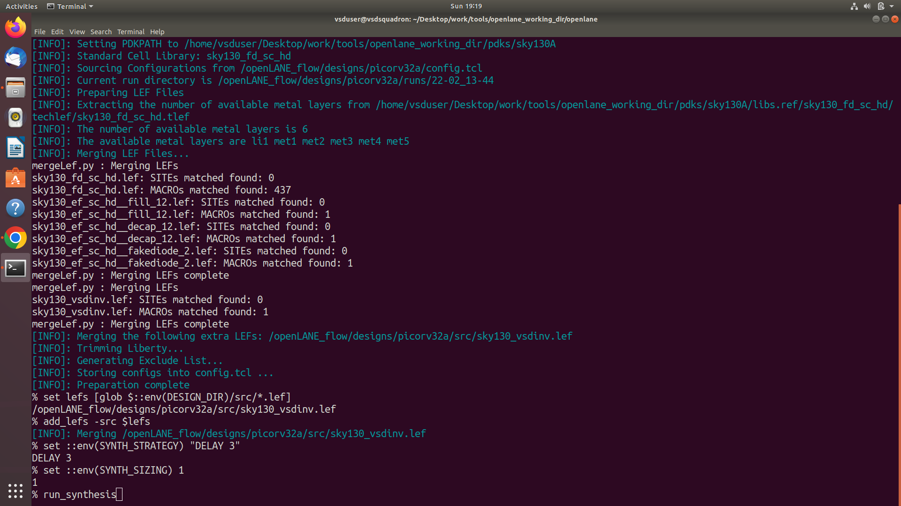

# soc-design-and-planning

# RTL-to-GDSII SoC Design Flow using OpenLANE & SKY130

---

##  Overview

This repository documents my complete learning journey through the open-source RTL-to-GDSII SoC design flow using **OpenLANE** and the **Sky130 PDK**.  
The objective of this project is to understand how a digital processor design moves from a high-level Verilog description to a manufacturable physical layout.

The work follows a structured day-wise approach covering:

- Synthesis  
- Floorplanning  
- Placement  
- Clock Tree Synthesis  
- Routing  
- Final Layout Generation  

Each stage focuses on both theoretical understanding and practical implementation supported by reports, command execution, and layout visualization.

---

##  Learning Objectives

The main goals of this project are:

- To understand the complete ASIC design flow using open-source EDA tools  
- To analyze how RTL logic is transformed into standard-cell hardware  
- To observe how physical design decisions influence timing and layout quality  
- To gain hands-on experience with OpenLANE, Magic, and Sky130 libraries  

This repository acts as a practical reference for anyone beginning digital physical design using open tools.

---

## 🛠 Tools and Technologies Used

The following tools were used throughout the design flow:

- **OpenLANE** — Automated RTL-to-GDS flow  
- **Yosys** — Logic synthesis  
- **OpenROAD** — Physical design and optimization  
- **Magic** — Layout visualization  
- **Sky130 PDK** — Standard cell library and technology data  

Each tool contributes to a specific stage of the ASIC workflow, from logic mapping to final layout verification.

---


---

##  Day-Wise Documentation

### Day 1 — Inception of Open-Source EDA and Synthesis

- Introduction to OpenLANE and Sky130  
- Understanding library cells and flop ratio  
- RTL synthesis and timing report analysis  
---
---

# Day 1 — Inception of Open-Source EDA, OpenLANE and Sky130 PDK
---

## PART 1 — THEORY

### Overview of Chip Packaging and Design Fundamentals

The first part of Day-1 focused on understanding how a digital integrated circuit is physically organized inside a semiconductor package. A QFN-48 package was introduced to explain how the silicon die connects to external pins through bonding structures. The internal architecture of a chip includes several essential components that work together to enable signal transmission and processing.

Pads form the interface between the external environment and the internal circuitry of the chip. These metal structures carry input signals, output signals, power, and ground connections. Inside the chip boundary lies the core region, which contains the digital logic responsible for executing operations. The core is fabricated on a silicon die, which is the physical substrate manufactured using semiconductor processing techniques.

The session also introduced the concept of foundry IPs and digital macros. Foundry IPs are pre-validated blocks supplied by the fabrication process, including modules such as PLLs, SRAMs, and ADCs. Macros are reusable digital blocks built using standard cells, commonly used for interfaces like GPIO or SPI. Both IPs and macros help accelerate design development by providing reliable, pre-designed components.

---

### Introduction to OpenLANE and the RTL-to-GDSII Flow

OpenLANE was presented as a fully automated open-source ASIC design flow that integrates multiple tools into a single environment. Instead of relying on proprietary EDA software, OpenLANE combines Yosys for synthesis, OpenROAD for physical design, Magic for layout visualization, and TritonRoute for routing.

The RTL-to-GDSII flow begins with Verilog RTL, which describes the logical behaviour of the circuit. During synthesis, this RTL is translated into a gate-level netlist using standard cells from the Sky130 library. Floorplanning defines the physical dimensions of the chip and establishes the power network. Placement arranges cells inside the core area, while Clock Tree Synthesis distributes clock signals evenly to sequential elements. Routing connects the cells using metal layers, and finally the design is exported as a GDS-II layout ready for fabrication.

---

### Synthesis Basics and Flop Ratio

A major theoretical topic covered during Day-1 was the synthesis process. RTL descriptions written in Verilog are abstract and cannot be fabricated directly. Synthesis tools analyze the logic and map it into standard cells defined by the technology library.

One important metric discussed was the flop ratio, which represents the proportion of sequential elements relative to the total number of cells in the design. This metric helps designers estimate how much of the circuit is controlled by registers versus combinational logic. A balanced flop ratio often indicates a well-structured processor pipeline, while extreme values may signal timing or design complexity challenges.

---

### Standard Library Cells

Standard library cells are pre-designed building blocks used to implement digital logic on silicon. These cells include gates such as NAND, NOR, and inverters, as well as sequential elements like flip-flops. Each cell is defined by multiple library files:

* `.lib` → timing and power information
* `.lef` → physical dimensions and pin locations
* `.gds` → layout geometry used during fabrication

Understanding these libraries is essential because synthesis and floorplanning rely on them to determine how logic is mapped and how much physical space each cell occupies.

---

### Introduction to picorv32a Processor Core

The picorv32a RISC-V processor core was selected as the reference design for this lab. This lightweight processor provides a realistic digital architecture while remaining manageable within an open-source flow. It includes instruction decoding, arithmetic operations, and register storage, allowing designers to observe how a complete processor behaves during synthesis. Using a processor design instead of a small example circuit helps demonstrate how synthesis reports reflect real architectural complexity.

---

## PART 2 — IMPLEMENTATION

### SECTION 1 : Introduction of Open-Source EDA Tools, OpenLANE and SKY130 PDK

This section marks the beginning of the practical workflow. The main task here is to initialize the OpenLANE environment and prepare the picorv32a design for execution. The implementation involves launching the interactive flow, loading configuration files, and linking the Sky130 PDK libraries with the design sources. A dedicated run directory is created to store logs, reports, and generated files for this specific design instance.

The purpose of this stage is to ensure that all necessary inputs are correctly configured before moving into synthesis. By establishing the design environment, OpenLANE prepares the framework required for subsequent steps in the ASIC design flow.

---

### SECTION 2 : Good Floorplan vs Bad Floorplan and Preface to Library Cells

In this section, the focus shifts toward understanding how synthesis results influence physical design preparation. The tasks involve examining how utilization targets, aspect ratio, and the dimensions of standard cells affect the way a design will later be placed and routed. Instead of producing a final layout, this stage concentrates on preparing the design and recognizing how library cell characteristics contribute to efficient planning.

The workflow also introduces the idea of evaluating floorplan quality by comparing balanced layouts with inefficient ones. Observing how cell distribution and library parameters impact area usage helps designers anticipate potential congestion issues during placement and routing.

---

## PART 3 — COMMANDS USED + OUTPUT RESULTS

### 1.  Entering the Project Directory

```bash
/Desktop/work/tools/openlane_working_dir/openlane
```


---

### 2. Navigating to OpenLANE Environment

```bash
cd OpenLane
```

**Purpose**

* Enter the OpenLANE workspace where the RTL-to-GDS flow is executed.

---

### 3. Launching OpenLANE Interactive Mode

```bash
./flow.tcl -interactive
```

**Purpose**

* Start OpenLANE in interactive mode to manually control synthesis.

**Result**

```
OpenLane>
```

Environment variables and Sky130 PDK paths are loaded.

---

### 4. Preparing the picorv32a Design

```bash
prep -design picorv32a
```

**Purpose**

* Load RTL files
* Link Sky130 library files
* Initialize run directory

**Outputs Generated**

```
runs/picorv32a/
 ├── logs/
 ├── reports/
 ├── results/
 └── tmp/
```

---

### 5. Running Synthesis

```bash
run_synthesis
```

**Purpose**

* Convert Verilog RTL into gate-level netlist using Yosys and ABC.
* Optimize logic and perform timing-aware mapping.

**Outputs Generated**

* Gate-level netlist
* Timing reports
* Cell statistics report


---

### 6. Opening Synthesized Netlist Using Vim

```bash
~/Desktop/work/tools/openlane_working_dir/openlane/designs/picorv32a/runs/15-02_11-33/results/synthesis$ gvim picorv32a.synthesis.v

```


Exit Vim:

```bash
ESC
:q!
```

---

### 7. Viewing Synthesis Reports

```bash
~/Desktop/work/tools/openlane_working_dir/openlane/designs/picorv32a/runs/15-02_11-33/reports/synthesis$ gvim 1-yosys_4.chk.rpt
```


Observed:

* Arrival time
* Required time
* Slack information

---

### 8. Checking Cell Statistics (Flop Ratio Observation)





### 9. Inspecting Synthesis Logs

```bash
/Desktop/work/tools/openlane_working_dir/openlane/designs/picorv32a/runs/15-02_11-33/logs/synthesis$ gvim 1-yosys.log

```


---


---

## Day-1 — Generated Outputs and Important Observations

### Files and Data Generated During Day-1

* Run directory structure created
* Gate-level netlist generated
* Timing analysis reports created
* Cell statistics reports produced
* Synthesis log files generated

---

### Important Technical Points Learned in Day-1

* `prep -design` initializes the design environment.
* `run_synthesis` invokes Yosys and ABC mapping.
* Behavioral RTL is converted into standard cell gate instances.
* Timing reports reveal the longest delay path.
* Cell statistics help estimate flop ratio.
* LEF and LIB files define electrical and physical properties.

---

## Day-1 : Flowchart — RTL TO SYNTHESIZED NETLIST

```
Verilog RTL
     |
[Yosys Parsing]
     |
Hierarchy Analysis & Logic Optimization
     |
[ABC Technology Mapping]
     |
Standard Cell Gate-Level Netlist
     |
Timing Analysis & Optimization
     |
Final Netlist + Reports Generated
```

The synthesis stage transforms the abstract RTL description into a technology-mapped hardware representation by optimizing logic and applying Sky130 standard cell constraints.


---

## Requirec Calculation for day-1:

Flop ratio = Number of D flip Flops / Total Number of cells 
#### % of DFF’s = Flop ratio * 100 
Flop ratio = 1613 / 14876 
#### % of DFF’s = 0.108429685 * 100 = 10.84296854 % 
---
---
---
### Day 2 — Floorplanning and Physical Preparation

- Core area definition and utilization analysis  
- Power planning concepts and tap cell insertion  
- Evaluation of floorplan quality  
---
---
# Day 2 — Floorplanning and Physical Design Preparation

---

## PART 1 — THEORY

### Understanding Floorplanning in Physical Design

Day-2 focuses on the transition from logical synthesis to physical implementation through the floorplanning stage. Floorplanning defines the physical dimensions of the chip and establishes how the design will occupy silicon area. Unlike synthesis, which operates on logical structures, floorplanning introduces spatial awareness by assigning boundaries to the design and preparing regions for cell placement.

The chip layout is divided into the die area and the core area. The die represents the total silicon region, while the core contains the digital logic generated during synthesis. Proper definition of these regions is essential because it directly affects routing efficiency, timing performance, and power distribution.

A major concept discussed during this stage is utilization, which represents how much of the available core area is occupied by standard cells. Balanced utilization allows sufficient routing space and avoids congestion. Aspect ratio is another important factor, describing the relationship between core width and height. Designs with balanced proportions typically result in shorter interconnects and improved timing.

---

### Power Planning and Physical Infrastructure

Floorplanning also introduces power distribution planning. To ensure reliable operation, power and ground networks are established across the design. Special structures such as tap cells and decap cells are inserted to maintain substrate stability and reduce noise. These physical support cells do not implement logic but play an important role in maintaining electrical integrity.

Another key theoretical aspect is understanding how library cells influence physical design. During floorplanning, the tool reads LEF files from the standard cell library to determine cell dimensions and pin locations. This information allows the design tool to create placement rows aligned with power rails, ensuring that all cells can be placed in a manufacturable manner.

---

### Good Floorplan Characteristics

A well-defined floorplan ensures efficient placement and routing. Balanced utilization, appropriate aspect ratio, and evenly distributed power structures help minimize congestion and timing issues. Poor floorplanning decisions, such as extremely high utilization or irregular shapes, can lead to routing failures and increased delays later in the design flow.

The theoretical takeaway from this stage is that floorplanning acts as the foundation of physical design. Decisions made at this step strongly influence placement quality, clock tree synthesis, and final routing performance.

---

## PART 2 — IMPLEMENTATION

### Section 1 — Floorplan Initialization and Design Setup

The implementation of Day-2 begins by transitioning from logical synthesis into physical planning. At this stage, the synthesized netlist generated during Day-1 is used as the primary input for defining the physical structure of the chip. The main task performed here is initializing the floorplan environment inside OpenLANE, where the tool calculates the die boundary and core region based on utilization targets and configuration parameters.

The design tool reads the technology LEF and merged LEF files to understand the dimensions of standard cells. Using this information, placement rows are generated across the core region. These rows act as alignment guides that ensure standard cells will later sit correctly on power rails. This step establishes the geometric framework that will support all subsequent physical design stages.

---

### Section 2 — Die Area, Core Area and Utilization Analysis

After initialization, the implementation focuses on defining physical dimensions such as die size, core area, and utilization ratio. These parameters determine how densely the synthesized logic occupies the available silicon space. Designers observe how configuration settings influence the shape and size of the core, as well as how aspect ratio affects routing efficiency.

The objective of this section is to ensure that the design maintains a balanced layout. Excessively high utilization may lead to congestion during placement, while extremely low utilization wastes silicon area.

---

### Section 3 — Power Planning and Tap Cell Insertion

A key task during floorplanning is the preparation of the power infrastructure. The implementation includes automatic insertion of tap cells and other supporting elements required for reliable substrate connection. Tap cells help prevent latch-up issues by maintaining proper electrical biasing within the silicon.

During this stage, the tool also prepares the initial power distribution structure by aligning placement rows with predefined power rails.

---

### Section 4 — Introduction to Library Cells in Physical Context

The implementation then shifts toward understanding how library cells interact with the physical layout. Instead of focusing on logical functionality, this stage examines the physical characteristics of standard cells such as height, width, and pin alignment.

The merged LEF file plays a crucial role here because it combines technology information with cell definitions. By interpreting this data, the floorplanning process ensures that every cell from the synthesized netlist can be placed within the defined rows without violating design rules.

---

### Section 5 — Floorplan Quality Observation: Good vs Bad Layout Preparation

Another important activity during Day-2 implementation is evaluating how floorplan parameters affect design quality. Balanced aspect ratios and moderate utilization levels contribute to efficient layout preparation, while uneven shapes or overly dense configurations could lead to routing congestion in later stages.

---

### Section 6 — Generation of Initial Physical Representation

The final implementation step in Day-2 involves generating the initial DEF representation of the design. This DEF file reflects the first physical view of the processor, including die boundaries, core area, placement rows, and inserted tap cells.

This generated structure becomes the foundation for Day-3 placement.

---

## PART 3 — COMMANDS USED + OUTPUT RESULTS

### Running the Floorplanning Stage

```bash
# open in interactive mode for customisation
./flow.tcl -interactive
#Input all the required packages for the Design for proper functionality 
package require openlane 0.9
# Now openlane is ready to run the design 
prep -design picorv32a
# Now the design is ready for tne Synthesis
run_synthesis

run_floorplan
```

This command reads the synthesized gate-level netlist along with the technology library information and calculates the physical dimensions of the design. It defines the core boundary, creates placement rows, and inserts initial power planning structures.




---
```bash
#Change directory to the path containing floorplan def
/Desktop/work/tools/openlane_working_dir/openlane/designs/picorv32a/runs/15-02_11-33/results/floorplan/
#Command to open floorplan def file through magic
magic -T /Desktop/work/tools/openlane_working_dir/pdks/sky130A/libs.tech/magic/sky130A.tech lef read ../../tmp/merged.lef def read picorv32a.floorplan.def &
```


 
#### Equidistant placement of ports

#### port layer set through config.tcl
       
 ```bash
#congestion based placement
run_placement
 ```
                
 ```bash
 #Change directory to the path containing placement def
 cd /Desktop/work/tools/openlane_working_dir/openlane/designs/picorv32a/runs/15-02_11-33/results/plaement/
#Command to open floorplan def file through magic
magic -T /Desktop/work/tools/openlane_working_dir/pdks/sky130A/libs.tech/magic/sky130A.tech lef read ../../tmp/merged.lef def read picorv32a.placement.def &
 ```
   
---
### Files and Data Generated During Day-2

- Floorplan DEF File  
  A DEF file representing the initial physical layout is generated. It includes die boundaries, core dimensions, power rails, and placement rows.

- Floorplan Reports  
  Reports describing utilization, aspect ratio, and core area are produced.

- Tapcell and Power Planning Logs  
  Log files show the insertion of tap cells and other support structures.

- Updated Run Directory Data  
  New subdirectories related to floorplanning appear inside the run folder.

---

### Important Technical Observations from Day-2

- The `run_floorplan` command reads the synthesized netlist and standard cell LEF files to determine physical dimensions.
- Core area and utilization influence routing congestion and timing performance.
- Tap cells are automatically inserted to maintain substrate stability.
- The generated DEF file represents the first physical view of the design.
- Library cell dimensions define placement rows and alignment with power rails.
## Day-2 Flowchart — Synthesis Output to Floorplan

```
Synthesized Netlist
        |
[Read LEF & Technology Data]
        |
Core Area Calculation
        |
Placement Row Generation
        |
Tapcell & Power Structure Insertion
        |
Initial Floorplan DEF + Reports
```

The floorplanning stage converts logical synthesis results into a spatial framework by defining chip dimensions, power infrastructure, and placement rows that prepare the design for placement.

---
---
---
### Day 3 — Placement

- Global placement and density optimization  
- Detailed placement and legalization  
- Layout visualization after placement  
---
---

# Day 3 — Placement and Physical Cell Arrangement

---

## PART 1 — THEORY

### Introduction to Placement in ASIC Physical Design

Day-3 focuses on the placement stage of the physical design flow, where standard cells generated during synthesis are arranged within the core area defined during floorplanning. Placement transforms the abstract physical framework into a structured layout by assigning coordinates to each cell based on optimization goals such as wirelength reduction, timing performance, and congestion control.

Placement is typically divided into two phases:

- Global Placement
- Detailed Placement

During global placement, cells are distributed across the core area to achieve balanced density and minimize interconnect length. Detailed placement aligns cells precisely with placement rows while ensuring that design rules are satisfied.

Unlike synthesis, which focuses on logic transformation, placement introduces spatial relationships between cells. The physical distance between elements directly affects signal delay, making placement decisions critical for timing closure.

---

### Global Placement and Density Optimization

Global placement uses algorithms that estimate optimal cell positions without enforcing strict design rule alignment. The main objective is to achieve an even distribution of cells while minimizing overall wirelength. Placement tools consider congestion estimation, timing paths, and power regions during this process.

Density plays an important role during placement. Excessively dense regions can create routing bottlenecks, while sparse regions may lead to inefficient silicon usage.

---

### Detailed Placement and Legalization

After global placement, the design undergoes detailed placement. This phase refines cell positions to ensure that all cells align correctly with placement rows and do not overlap. Legalization corrects violations that may have occurred during global placement.

Detailed placement prepares the design for Clock Tree Synthesis by stabilizing the physical structure and ensuring that sequential elements are positioned appropriately.

---

### Role of Library Cells During Placement

Standard cell libraries continue to play a critical role during placement. The physical dimensions defined in LEF files determine how cells fit within rows and how spacing rules are applied. Flip-flops, buffers, and combinational cells are arranged to balance performance and routing feasibility.

Placement is an optimization process that directly impacts timing, power, and routing complexity.

---

## PART 2 — IMPLEMENTATION

### Section 1 — Initiating Global Placement

The Day-3 implementation begins by executing the placement stage using the floorplan DEF generated in Day-2. The tool distributes synthesized standard cells across the core region by analyzing connectivity and optimization parameters.

---

### Section 2 — Density Control and Congestion Awareness

The placement engine adjusts cell distribution to avoid overcrowded regions that could create routing challenges later. Designers observe how density settings influence the spread of logic across the core area.

---

### Section 3 — Detailed Placement and Legalization

Once global placement is completed, detailed placement refines cell positions by aligning them with predefined placement rows and removing overlaps. Legalization ensures that all standard cells adhere to technology constraints.

---

### Section 4 — Library Cell Interaction During Placement

The placement tool references library LEF data to determine the exact dimensions and orientation of each cell. Designers observe how flip-flops and combinational cells are arranged relative to one another.

---

### Section 5 — Evaluating Placement Quality

Designers evaluate placement results by observing:

- Even cell distribution  
- Minimal overlaps  
- Logical grouping of related modules  

This confirms readiness for the next stage.

---

## PART 3 — COMMANDS USED + OUTPUT RESULTS

### 1. Clone custom inverter standard cell design from github repository
```bash
# enter into the openlane
cd Desktop/work/tools0openlane_working_dir/openlane
# clone custom inverter design repo
git clone https://github.com/nickson-jose/vsdstdcelldesign
#copy magic tech file to the repo directory for easy access
cp Desktop/work/tools0openlane_working_dir/pdks/sky130A/libs.tech/magic/sky130A.tech
#open custom inverter through magic
magic -T sky130A.tech sky130_inv.mag &
```


---

###  Opening Layout Using Magic (Visual Verification)

```bash
#use anyone of the command to open the file
magic -T $PDK_ROOT/sky130A/libs.tech/magic/sky130A.tech \
lef read merged_unpadded.lef \
def read picorv32a.placement.def
```

Result:

- Standard cells visible inside rows  
- Core boundary displayed  
- Power rails aligned  
### : Opening Coustom Inverter


#### NMOS and PMOS identified
 
 
 
#### Output Y is connected to NMOS and PMOS (verified)
 
#### PMOS source connectivity to VDD 
 
#### NMOS source is connected to VSS(GND)
 
    
 
```bash
# check the current directory
pwd
# to extract .ext format
extract all
# before converting ext tp spice this command enable the parasitic extraction also
ext2spice cthresh 0 rthresh 0
# converting to ext to spice
ext2spice
```
 
 #### Screenshot of the spice file created
 
      
 
---

## Now the final file is ready for ngspice simulation
 

---
### Post Layout ngspice simulation 
```bash
# Commands to load spice file for simulation to ngspice
ngspice sky130_inv.spice
# plot the time vs voltage
plot y vs time a
```

         
---

---

## Find errors/problems in DRC section of the old magic tech file for the skywater process and fix them.

  
#### Incorrectly implemented poly.9 simple rule correction
   
 #### New commands inserted in sky130A.tech file to update drc
         
  #### commands to run in tkcon window
  ```bash
  # loading updated tech file
  tech load sky130A.tech
  # Change drc style to drc full
  drc style drc(full)
  # drc check to see updated drc errors
  drc check
  # The selected region will show the reson for the error
  drc why
  ```
       
### Magic window with rule implemented

---

## Day-3 Outputs Generated

1. Placement DEF file containing coordinates of standard cells  
2. Placement reports describing density and optimization  
3. Updated logs documenting placement process  
4. Visual layout view showing placed cells  

---

## Files and Data Generated During Day-3

- Placement DEF File  
- Placement Reports  
- Placement Logs  
- Updated Layout Visualization  

---

## Important Technical Observations from Day-3

- `run_placement` reads floorplan DEF and library data.
- Global placement minimizes wirelength and congestion.
- Detailed placement aligns cells with rows and resolves overlaps.
- Placement DEF shows organized processor structure.
- Proper placement improves timing and prepares for CTS.

---

## Day-3 Flowchart — Floorplan to Placed Design

```
Floorplan DEF + Netlist
        |
[Global Placement Engine]
        |
Density Optimization & Wirelength Estimation
        |
Detailed Placement & Legalization
        |
Final Placement DEF + Reports
```

The placement stage converts the floorplan framework into an organized physical layout by assigning optimized positions to standard cells while maintaining density balance and design rule compliance.

---
### Required Calculation for day-3:
---
#### Rise transition time calculation 
#### Rise time = Time taken for the output to rise to 80% - Time taken for the output to rise to 20%
- 80% = 2.64mV
- 20% = 660mV
- Rise transition time = 2.246 - 2.182 = 0.064 ns = 64 ps

#### Fall transition time = Time taken for the output to fall to 20% - Time taken for the output to fall to 80 %
- 20%=660mV
- 80%=2.64mV
- Fall transition time = 4.0955 - 4.0536 = 0.0419 ns = 41.9 ps

#### Rise cell delay= Time taken for the output to rise to 50% - Time taken for the input to rise to 50 %
- 50% of 3.3V = 1.65V
- Rise cell delay= 2.21144 - 2.15008 = 0.06136ns = 61.36 ps

#### Fall cell delay= Time taken for the output to fall to 50% - Time taken for the input to fall to 50%
- 50% of 3.3V = 1.65V
- Fall cell delay= 4.07 - 4.05 = 0.02ns = 20 ps
---
---
---
### Day 4 — Clock Tree Synthesis

- Clock buffer insertion  
- Skew and latency analysis  
- Preparation for routing stage  
---
---
# Day 4 — Clock Tree Synthesis and Routing Preparation

---

## PART 1 — THEORY

### Clock Distribution and the Need for Clock Tree Synthesis

After placement, the design contains thousands of sequential elements such as flip-flops that must receive the clock signal simultaneously. If the clock reaches different parts of the design at different times, it can lead to setup and hold violations. To avoid this, a structured clock network is created during the Clock Tree Synthesis (CTS) stage.

Clock Tree Synthesis builds a hierarchical network of buffers and inverters that distribute the clock signal evenly across the core. Instead of a single long wire, the clock is propagated through a balanced tree structure, which reduces skew and improves timing reliability. The CTS engine considers placement information, cell locations, and timing constraints while constructing this network.

Clock skew refers to the difference in arrival time of the clock signal at various flip-flops. Minimizing skew ensures predictable timing behavior across the design. CTS also controls clock latency, which is the delay introduced by the clock network itself.

---

### Routing Concepts and Signal Interconnection

Once cells and clock buffers are positioned, the next step is preparing the design for routing. Routing creates physical metal connections between cells based on the netlist connectivity. The process uses multiple metal layers, each assigned specific routing directions to reduce interference and congestion.

Routing is divided into:

- Global Routing
- Detailed Routing

Global routing estimates paths for wires across the design, while detailed routing assigns exact tracks that satisfy design rules. Design Rule Checks (DRC) ensure that spacing, width, and overlap constraints defined by the technology library are maintained.

---

### Role of Library Cells During CTS

During Clock Tree Synthesis, the tool uses specific buffer and inverter cells from the standard cell library to build the clock network. These cells are chosen based on drive strength and timing requirements. Library timing data helps determine where buffers should be inserted to maintain balanced clock distribution.

CTS is therefore both a logical and physical optimization process guided by library characteristics.

---

## PART 2 — IMPLEMENTATION

### Section 1 — Initiating Clock Tree Synthesis

The implementation begins by executing the CTS stage using the placement DEF generated in Day-3. The CTS engine analyzes flip-flop locations and determines optimal buffer insertion points to maintain uniform clock arrival times.

---

### Section 2 — Clock Buffer Insertion and Timing Preparation

Clock buffers are inserted automatically based on timing requirements. Designers observe additional standard cells appearing in the layout, representing the clock distribution network.

This process prepares the design for accurate timing analysis by stabilizing clock paths and minimizing skew.

---

### Section 3 — Preparing for Routing

After CTS, the implementation focuses on verifying integration between placement and clock structures. Designers observe routing channels and ensure that clock buffers align with placement rows.

Although detailed routing occurs later, Day-4 prepares the framework required for routing.

---

### Section 4 — Evaluating CTS Quality

Designers review timing reports to observe:

- Clock latency
- Clock skew
- Buffer distribution

Balanced values indicate readiness for routing and sign-off checks.

---

## PART 3 — DAY-4 COMMAND TIMELINE + OUTPUT RESULTS

```bash 
cd Desktop/work/tools/openlane_working_dir/openlane/vsdstdcelldesign

magic -T sky130A.tech sky130_inv.mag &
```
---
 
---

```bash
# Get syntax for grid command
held grid
# Set grid values aaccordingly
grid 0.46um 0.34um 0.23um 0.17um
```
#### Condition 1 verified

 #### Condition 2 verified
 ##### horizontal\track\pitch=0.46\um
 
#### condition 3 verified
##### Vertical\track\pitch =0.34\um
 


```bash
# lef write
lef write
```
 
 ##### screenshot of newly created lef file
   
  ```bash
# copy lef file
cp sky130_vsdinv.lef ~/Desktop/worl/tools/openlane_working_dir/openlane/design/picorv32a/src/
# List and check whether its copied
ls ~/Desktop/worl/tools/openlane_working_dir/openlane/design/picorv32a/src/
# Copy lib files
cp libs/sky130_fd_sc_hd__* ~/Desktop/worl/tools/openlane_working_dir/openlane/design/picorv32a/src/
# Check
ls /Desktop/worl/tools/openlane_working_dir/openlane/design/picorv32a/src/
  ```
  
#### edit "config.tcl" to change lib file and add the new extra lef into the openlane flow.

##### Commands to be added to config.tcl to include our custom  cell in the openlane flow
```bash
set ::env(LIB_SYNTH) "$::env(OPENLANE_ROOT)/design/picorv32a/src/sky130_fd_sc_hd__typical.lib"

set ::env(LIB_FASTEST) "$::env(OPENLANE_ROOT)/design/picorv32a/src/sky130_fd_sc_hd__fast.lib"

set ::env(LIB_SLOWEST) "$::env(OPENLANE_ROOT)/design/picorv32a/src/sky130_fd_sc_hd__slow.lib"

set ::env(LIB_TYPICAL) "$::env(OPENLANE_ROOT)/design/picorv32a/src/sky130_fd_sc_hd__typical.lib"
```
##### Edited config.tcl 
 

 
```bash
# Entered in the project 
cd /Desktop/work/tools/openlane_working_dir/openlane
Docker
# Openalne in interactive mode
./flow.tcl -interactive
# input all the require packages for the design
package require openlane 0.9
# Now our design is ready for synthesis
prep -design picorv32a
# Additional commands to include newly added lef 
set lefs [glob $::env(DESIGN_DIR)/src/*.lef]
add_lefs -src $lefs
# Now design is ready ,so run the synthesis using the following command
run_synthesis
```


 

 
```bash
prep -design picorv32a -tag 22-02_13-44 -overwrite

set lefs [glob $::env(DESIGN_DIR)/src/*.lef]

echo $::env(SYNTH_STRATEGY)

set $::env(SYNTH_STRATEGY)

echo $::env(SYNTH_BUFFERING)

echo $::env(SYNTH_SIZING)

set $::env(SYNTH_SIZING) 1

echo $::env(SYNTH_DRIVING_CELL)

run_synthesis
```

   
  
 
  
 
  
 
  
 
  
 
  
 ```bash
# Now we can run floorplan
run_floorplan
 ```
  
 ##### If we face error while using run_floorplan then use these following commands 
 ```bash
init_floorplan
place_io
tap_decap_or
 ```
  
 
  
 
  
 
  
 
  
 #### Change directory to path containing placement def 
 ```bash
cd /Desktop/work/tools/openlane_working_dir/openlane/designs/picorv32a/runs/22-02_13-44/results/placement/
# command in the magic tool
magic -T /Desktop/work/tools/openlane_working_dir/pdks/sky130A/libs.tech/magic/sky130A.tech lef read ../../tmp/merged.lef def read picorv32a.placement.def &
 ```
  
 

  
 
  
 ```bash
 # command to view internal connectivity layers
 expand
 ```

  
 
  
 
  
 
 #### Newly created "my_base.sdc"
  
 #### Newly created pre_sta.conf
  
 ```bash
# change directory to openlane 
cd Desktop/work/tools/openlane_working_dir/openlane
# invoke openSTA tool with script
sta pre_sta.conf
 ```
  
 
  
 
  
 
  
 
  

  
 
  
 
  
 
  
 
  
 
  
 
  
  ```bash
# Report_net -connection to a net
report_net -connections _11672_
# Checking command syntax
help replace_cell
# Replace cell
replace_cell _14510_ sky130_fd_sc_hd__or3_4
# Genrating custom timinf report
report_checks -fields {net cap slew input_pins} -digits 4

 ```
  
 
  
 
  

  
 
  
 
  
 
  
 
  
  ```bash
# Report_net -connection to a net
report_net -connections _11675_
# Checking command syntax
help replace_cell
# Replace cell
replace_cell _14514_ sky130_fd_sc_hd__or3_4
# Genrating custom timinf report
report_checks -fields {net cap slew input_pins} -digits 4

 ```
  
 
  
 
  
 
  
 
  
 
  
  ```bash
# Report_net -connection to a net
report_net -connections _11643_
# Checking command syntax
help replace_cell
# Replace cell
replace_cell _14481_ sky130_fd_sc_hd__or4_4
# Genrating custom timinf report
report_checks -fields {net cap slew input_pins} -digits 4

 ```
  
 
  
 
  
  ```bash
# change directory to synthesis results directory
cd Desktop/work/tools/openlane_working_dir/openlane/design/picorv32a/22-02_13-44/synthesis/
# list contents of the current directory
ls
# copy and rename the netlist
cp picorv32a.synthesis.v picorv32a.synthesis_old.v
#list
ls

 ```
  
 
  
 
  
 
  
 
  
 ```bash
prep -design picorv32a -tag 22-02_13-44 -overwrite

set lefs [glob $::env(DESIGN_DIR)/src/*.lef] add_lefs -src &lefs

set ::env(SYNTH_STRATEGY) 

set ::env(SYNTH_SIZING) 1

run_synthesis

init_floorplan
place_io
tap_decap_or

run_placement

unset ::env(LIB_CTS)

run_cts
 ```
  
 
  
 
  
 
  
 
  
 
  
 
  
 
 
 

  

   

    

     

     

 

  

```bash
echo $::env(CTS_CLK_BUFFER_LIST)

set ::env(CTS_CLK_BUFFER_LIST) [lreplace $::env(CTS_CLK_BUFFER_LIST)0 0]

echo $::env(CURRENT_DEF)

set ::env(CURRENT_DEF) /openLANE_flow/designs/picorv32a/runs/22-02_13-44/results/plaement/picorv32a.placement.def

run_ctc

echo $::env(CTS_CLK_BUFFER_LIST)

openroad

read_lef /openLANE_flow/designs/picorv32a/runs/22-02_13-44/tmp/merged.lef

read_def /openLANE_flow/designs/picorv32a/runs/22-02_13-44/results/cts/picorv32a.cts.def

write_db pico_cts1.db

read_db pico_cts.db

read_verilog /openLANE_flow/designs/picorv32a/runs/22-02_13-44/results/synthesis/picorv32a.synthesis_cts.v

```

    

 

  

 

 

  

 
 
 

 

---

## Day-4 Outputs Generated

- CTS DEF file with inserted clock buffers
- Clock timing reports showing skew and latency
- Updated layout view displaying clock network structure
- CTS logs documenting optimization

---

## Day-4 Flowchart — Placement to Clock Tree

```
Placed DEF + Netlist
        |
[Clock Tree Synthesis Engine]
        |
Clock Buffer & Inverter Insertion
        |
Clock Skew Optimization
        |
Updated DEF + CTS Reports
```

Clock Tree Synthesis transforms a single clock net into a balanced distribution network by inserting library buffer cells to reduce skew and maintain timing stability.

---
---
---

### Day 5 — Routing and Final Layout

- Metal layer routing  
- Design rule verification  
- Final layout generation and visualization  

Each day includes screenshots, commands used, reports generated, and important observations from the implementation.
---
---

# Day 5 — Routing, Sign-Off Checks and Final Layout Generation

---

## PART 1 — THEORY

### Signal Routing and Physical Connectivity

Day-5 concentrates on completing the physical connections between all standard cells and preparing the design for final verification. After Clock Tree Synthesis, cells and clock buffers are already positioned, but electrical connections still need to be established. Routing is the stage where metal layers are used to create wires that connect pins according to the gate-level netlist.

Routing occurs in two main phases:

- Global Routing
- Detailed Routing

Global routing estimates paths for interconnections by dividing the layout into routing regions and calculating congestion. Detailed routing assigns exact tracks while respecting design rules such as spacing, metal width, and via placement.

Signal integrity becomes important at this stage. Long wires introduce resistance and capacitance, increasing delay. The routing tool balances path length with congestion avoidance to maintain timing performance.

---

### Design Rule Checking and Layout Verification

Once routing is completed, the design must undergo verification to confirm that it meets fabrication constraints.

- Design Rule Checking (DRC) validates spacing, width, and alignment requirements.
- Layout Versus Schematic (LVS) confirms that the routed layout matches the original logical netlist.

These checks ensure that the design can be manufactured without errors.

---

### Generation of Final Layout Data

After routing and verification, the design is exported into a GDS-II file. This file contains all geometric information required by the foundry, including:

- Cell placements
- Routing layers
- Power structures

The GDS-II file represents the physical outcome of the entire RTL-to-GDS process.

---

## PART 2 — IMPLEMENTATION

### Section 1 — Initiating Routing Stage

The routing stage begins using the DEF produced after Clock Tree Synthesis. The routing engine reads connectivity and placement coordinates to determine optimal signal paths.

Both global routing estimation and detailed routing execution are performed automatically.

---

### Section 2 — Metal Layer Utilization and Wire Optimization

Different metal layers are used for horizontal and vertical routing directions. The tool minimizes wirelength while maintaining spacing rules and inserting vias between layers for connectivity.

The routing structure becomes visible in layout visualization tools.

---

### Section 3 — Design Rule Checking and Verification Preparation

After routing completes, verification tasks confirm adherence to fabrication rules. Designers review DRC and LVS reports to ensure there are no violations.

---

### Section 4 — Final Layout Preparation

The final step prepares the design for export into the GDS-II format. The layout now contains:

- Placed cells
- Clock buffers
- Routed metal layers

Successful reports indicate readiness for final layout generation.

---

## PART 3 — DAY-5 COMMAND TIMELINE + OUTPUT RESULTS

### 1. Entering the OpenLANE Interactive Environment

```bash
cd OpenLane
./flow.tcl -interactive
```

Purpose:

- Launch OpenLANE and load technology configuration.

---

### 2. Preparing the Design

```bash
prep -design picorv32a
```

Purpose:

- Load previous stages including placement and CTS results.

---

```bash
# To include newly added lef to openlane flow merged.lefs
set lefs [glob $::env(DESIGN_DIR)/src/*.lef] add_lefs -src &lefs
# Command to set new value for SYNTH_STRATEGY
set ::env(SYNTH_STRATEGY) 
# Command to set new value for SYNTH_STRATEGY
set ::env(SYNTH_SIZING) 1
# After design is ready now we can run synthesis
run_synthesis
# optional use this or run_floorplan
init_floorplan
place_io
tap_decap_or
# Now we are ready for the placement
run_placement
# optional incase getting error
unset ::env(LIB_CTS)
# After placement now we are ready for the CTS
run_cts
# After the CTS is done now we can do power distribution network
gen_pdn

```


---

### screenshots of PDN

 

 

 

 
```bash
# Change directory to path of generated PDN def
cd /Desktop/worl/tools/openlane_working_dir/openlane
# Command to load the pdn def in magic tool
magic -T /Desktop/worl/tools/openlane_working_dir/openlane/pdks/sky130A/libs.tech/magic/sky130A.tech lef read ../../tmp/merged.lef def read 14-pdn.def &
```
 

 

  

 
---
### Prefrom detailed routing using TritonRoute and explore routed layout

```bash
# Check value of current def
echo $::env(CURRENT_DEF)
# Check value of Routing_strategy
echo $::env(ROUTING_STRATEGY)
# route using Triton Route
run_routing

```


---


  
---

##### command to load routed def in magic 

```bash
# Change directory to path of generated PDN def
cd /Desktop/worl/tools/openlane_working_dir/openlane
# Command to load the pdn def in magic tool
magic -T /Desktop/worl/tools/openlane_working_dir/openlane/pdks/sky130A/libs.tech/magic/sky130A.tech lef read ../../tmp/merged.lef def read 14-pdn.def &
```
---

   
---

###  Checking Design Rule Violations

```bash
# Change directory
cd Desktop/worl/tools/SPEF_EXTRACTOR

# Command extract spef
python main.py /Desktop/work/tools/openlane_working_dir/desings/picorv32a/runs/22-02_13-44/tmp/merged.lef /Desktop/work/tools/openlane_working_dir/desings/picorv32a/runs/22-02_13-44/results/routing/picorv32a.def
```

Purpose:

- Review DRC or verification results before final export.


  
 
 ## Post route openSTA timming analysis
 
 ```bash
openroad

read_lef /openLANE_flow/designs/picorv32a/runs/22-02_13-44

read_def /openLANE_flow/designs/picorv32a/runs/22-02_13-44/results/routing/picorv32a.def

write_db pico_route.db

read_verilog /openLANE_flow/designs/picorv32a/runs/22-02_13-44/results/synthesis/picorv32a.synthesis_preroute.v

read_liberty $::env(LIB_SYNTH_COMPLETE)

link_design picorv32a

read_sdc /openLANE_flow/designs/picorv32a/src/my_base.sdc

set_propagated_clock [all_clock]

read_spef /openLANE_flow/designs/picorv32a/runs/22-02_13-44/results/routing/picorv32a.spef

reportt_check -path_delay min_max -fields {slew trans net cap input_pins} -format full_clock_expanded -digits 4

exit
 ```
     
---

### 8. Generating Final GDS Layout

```bash
run_magic
```

Purpose:

- Export the final physical layout.

Output:

- `.gds` file representing the complete chip layout.

---

## Day-5 Outputs Generated

- Routed DEF file containing final metal interconnections
- Routing reports describing congestion and layer usage
- Sign-off verification reports
- Final GDS-II layout file
- Layout visualization showing full chip structure

---

## Day-5 Flowchart — CTS to Final Layout

```
CTS DEF + Netlist
        |
[Global Routing]
        |
Detailed Routing
        |
Design Rule Checking
        |
Final Layout Generation (GDS)
```

The routing stage converts placement and clock distribution into a fully connected physical design by creating metal interconnections that satisfy technology rules and timing constraints.
---
---
---

##  Repository Structure

```
├── Day1/
├── Day2/
├── Day3/
├── Day4/
├── Day5/
├── Day1.md
├── Day2.md
├── Day3.md
├── Day4.md
├── Day5.md
└── README.md
```

---

##  Acknowledgment

I would like to sincerely express my gratitude to **Mr. Kunal Ghosh**, Co-founder of VLSI System Design (VSD) Corp. Pvt. Ltd., for creating an open and practical learning environment that made it possible to explore the complete RTL-to-GDSII flow using open-source tools. His structured approach to teaching physical design concepts greatly helped in building a clear understanding of real-world ASIC workflows.

I would also like to thank **Mr. Nickson Jose** for his valuable support and for guiding participants throughout the Digital VLSI SoC Design and Planning workshop. The insights shared during the sessions, along with the hands-on demonstrations, played an important role in strengthening both theoretical knowledge and practical skills.

This project is a result of the guidance, resources, and learning opportunities provided through the VSD program, which encourages students to gain industry-relevant experience using open-source EDA tools.